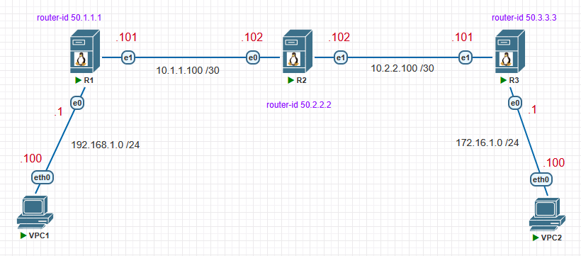

# Dynamic Routing with OSPF (FRR) on Linux

### 🖧 Topology
  
[Download Link for PNETLab Topology File](Topology/Topology_Dynamic_Routing_Linux.unl)

## Virtual PC Simulator
```shell
VPC1> ip 192.168.1.100/24 192.168.1.1
VPC1> ip dns 8.8.8.8
VPC1> show ip
VPC1> save
```
```shell
VPC2> ip 172.16.1.100/24 172.16.1.1
VPC2> ip dns 8.8.8.8
VPC2> show ip
VPC2> save
```

## R1

**Құрылғының атауын (Device Name) өзгерту**
```shell
$ sudo hostnamectl set-hostname R1
$ sudo nano /etc/hosts
127.0.1.1  R1
$ bash
```

**FRR (FRRouting) пакетін орнату және конфигурациялау**
```shell
$ sudo apt update
$ sudo apt install frr frr-pythontools

$ sudo systemctl status frr

$ sudo nano /etc/frr/daemons
zebra=yes
ospfd=yes

немесе
$ sudo sed -i 's/ospfd=no/ospfd=yes/' /etc/frr/daemons

$ sudo systemctl restart frr
$ sudo systemctl status frr
```

**Желілік интерфейсті конфигурациялау**
```shell
$ sudo nano /etc/network/interfaces
  auto ens3
  iface ens3 inet static
  address 192.168.1.1/24

  auto ens4
  iface ens4 inet static
  address 10.1.1.101/30

$ sudo systemctl restart networking
$ ip address
```

**OSPF конфигурациялау**
```shell
$ sudo vtysh
configure terminal
router ospf
router-id 50.1.1.1
network 10.1.1.100/30 area 0
network 192.168.1.0/24 area 0
exit
interface ens3
ip ospf passive
end

show ip ospf neighbor
write memory
exit
```

```shell
$ sudo vtysh
show running-config

$ sudo vtysh -c 'show running-config'

немесе

$ sudo cat /etc/frr/frr.conf
```

```shell
$ sudo vtysh
show ip route

немесе

$ ip route
```

## R2

**Желілік интерфейсті конфигурациялау**
```shell
$ sudo nano /etc/network/interfaces
  auto ens3
  iface ens3 inet static
  address 10.1.1.102/30

  auto ens4
  iface ens4 inet static
  address 10.2.2.102/30

$ sudo systemctl restart networking
$ ip address
```

**OSPF конфигурациялау**
```shell
$ sudo vtysh
configure terminal
router ospf
router-id 50.2.2.2
network 10.1.1.100/30 area 0
network 10.2.2.100/30 area 0
end

show ip ospf neighbor
write memory
exit
```

## R3

**Желілік интерфейсті конфигурациялау**
```shell
$ sudo nano /etc/network/interfaces
  auto ens3
  iface ens3 inet static
  address 172.16.1.1/24

  auto ens4
  iface ens4 inet static
  address 10.2.2.101/30

$ sudo systemctl restart networking
$ ip address
```

**OSPF конфигурациялау**
```shell
$ sudo vtysh
configure terminal
router ospf
router-id 50.3.3.3
network 10.2.2.100/30 area 0
network 172.16.1.0/24 area 0
exit

interface ens3
ip ospf passive
end

show ip ospf neighbor
write memory
exit
```

## Enable IP Packet Forwarding (R1, R2, R3)
```shell
$ sudo nano /etc/sysctl.conf
net.ipv4.ip_forward=1
net.ipv6.conf.all.forwarding=1 
$ sudo sysctl -p
```

## Verification
```shell
VPC1> ping 172.16.1.100
VPC2> ping 192.168.1.100
```

## Қосымша ақпарат
```shell
show ip ospf interface ens3
```
```shell
interface ens4
ip ospf hello-interval 10
ip ospf network broadcast
ip ospf mtu-ignore
```
```shell
show logging
show ip protocols
show ip ospf database
```
```shell
sudo frr-reload.py --reload /etc/frr/frr.conf
```
```shell
debug ospf events
```

## References

1) [Example YAML Files on GitHub](https://github.com/canonical/netplan/tree/main/examples)
