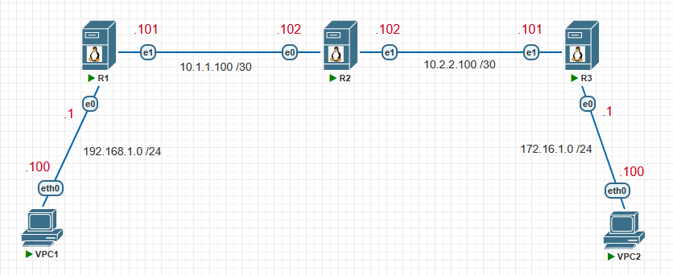

# Dynamic Routing on Linux

### Топология


## Virtual PC Simulator
```shell
VPC1> ip 192.168.1.100/24 192.168.1.1
VPC1> show ip
VPC1> save
```
```shell
VPC2> ip 172.16.1.100/24 172.16.1.1
VPC2> show ip
VPC2> save
```

## Dynamic Routing on Debian

**R1**
```shell
Құрылғының атауын (Device Name) өзгерту
$ sudo hostnamectl set-hostname R1
$ sudo nano /etc/hosts
127.0.1.1  R1
$ bash
```

```shell
FRR (FRRouting) пакетін орнату және конфигурациялау

$ sudo apt update
$ sudo apt install frr frr-pythontools

$ sudo systemctl status frr

$ sudo nano /etc/frr/daemons
zebra=yes
ospfd=yes

$ sudo systemctl restart frr
$ sudo systemctl status frr
```

```shell
$ sudo nano /etc/network/interfaces
  auto ens3
  iface ens3 inet static
  address 192.168.1.1/24

  auto ens4
  iface ens4 inet static
  address 10.1.1.101/30

$ sudo systemctl restart networking
```

```shell
OSPF конфигурациялау

$ sudo vtysh
configure terminal

router ospf
router-id 50.1.1.1
network 10.1.1.100/30 area 0
network 192.168.1.0/24 area 0
exit

interface ens4
ip ospf network broadcast
ip ospf mtu-ignore
exit

interface ens3
ip ospf passive
end

copy run start
exit
```

**R2**
```shell
Құрылғының атауын (Device Name) өзгерту
$ sudo hostnamectl set-hostname R2
$ sudo nano /etc/hosts
127.0.1.1  R2
$ bash
```

```shell
FRR (FRRouting) пакетін орнату және конфигурациялау

$ sudo apt update
$ sudo apt install frr frr-pythontools

$ sudo systemctl status frr

$ sudo nano /etc/frr/daemons
zebra=yes
ospfd=yes

$ sudo systemctl restart frr
$ sudo systemctl status frr
```

```shell
$ sudo nano /etc/network/interfaces
  auto ens3
  iface ens3 inet static
  address 10.1.1.102/30

  auto ens4
  iface ens4 inet static
  address 10.2.2.102/30

$ sudo systemctl restart networking
```

```shell
OSPF конфигурациялау

$ sudo vtysh
configure terminal

router ospf
router-id 50.2.2.2
network 10.1.1.100/30 area 0
network 10.2.2.100/30 area 0
exit

interface ens3
ip ospf network broadcast
ip ospf mtu-ignore
interface ens4
ip ospf network broadcast
ip ospf mtu-ignore
end

show ip ospf neighbor

copy run start
exit
```
