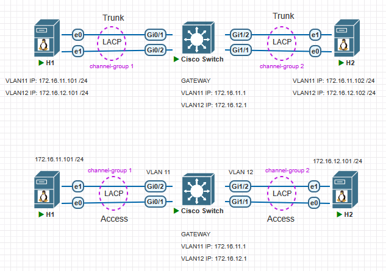
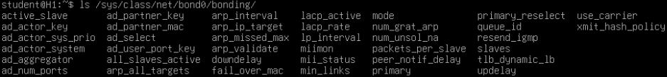
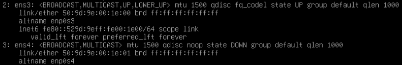
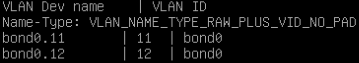
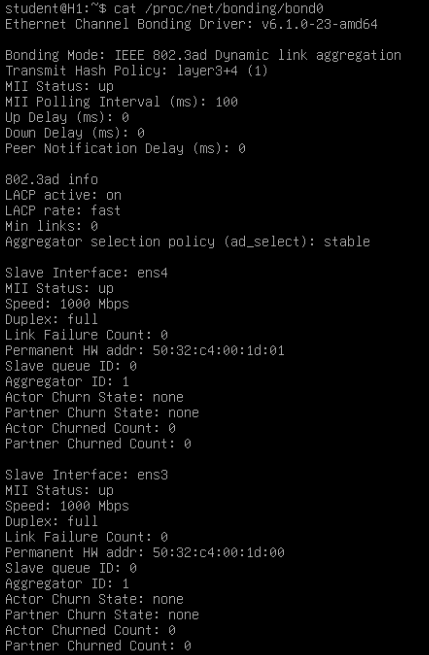
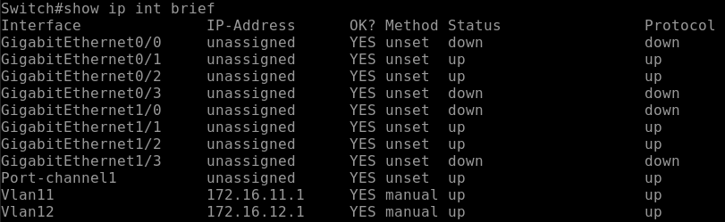
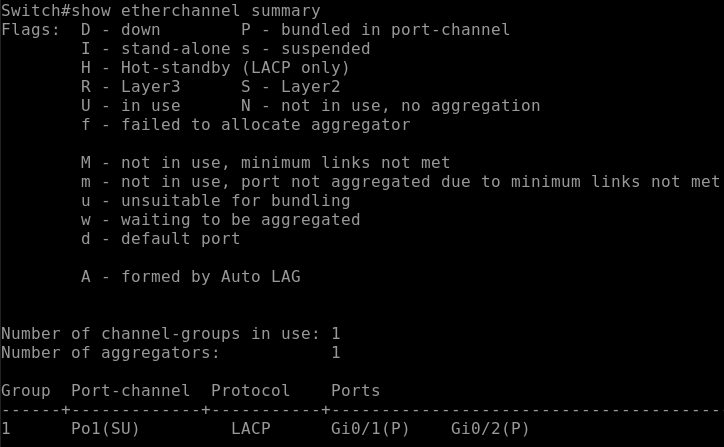

# Link Aggregation (LACP) and Bridging on Linux

### Топология


> **Ескерту:** PNETLab немесе EVE-NG эмуляторындағы Linux Qemu NIC қасиетін `Linux -> Edit Node -> Qemu NIC -> e1000` өзгерту қажет!

## NIC Bonding on Debian

#### Құрылғының атауын (Device Name) өзгерту
```shell
$ sudo hostnamectl set-hostname H1
$ bash
$ sudo nano /etc/hosts
127.0.1.1  H1
Ctrl+O -> Enter -> Ctrl+X -> Ctrl+L
```

#### Қажетті пакеттерді (package) орнату
```shell
$ sudo apt update
$ sudo apt install ifenslave ethtool
```

#### Bonding модулін жүктеу және автожүктеу қызметіне қосу
```shell
Bonding модулін жүктеу
$ sudo modprobe bonding
$ sudo modprobe -r bonding      // егер бұрын жүктелген болса

Bonding модулінің жүктелгенін тексеру
$ lsmod | grep bonding

Bonding модулін автожүктеу (startup) қызметіне қосу
$ echo "bonding" | sudo tee /etc/modules-load.d/bonding.conf
```

#### 8021q модулін жүктеу және автожүктеу қызметіне қосу (802.1Q VLAN)
```shell
8021q модулін жүктеу
$ sudo modprobe 8021q

8021q модулінің жүктелгенін тексеру
$ lsmod | grep 8021q

8021q модулін автожүктеу (startup) қызметіне қосу
$ echo "8021q" | sudo tee /etc/modules-load.d/8021q.conf
```

#### Bonding Mode
`0 - balance-rr` – Round Robin (load balancing and fault tolerance)  
`1 - active-backup` – бір ғана интерфейс белсенді, қалғаны резерв (fault tolerance and redundancy)  
`2 - balance-xor`  
`3 - broadcast`  
`4 - 802.3ad` – Link Aggregation Control Protocol (LACP)  
`5 - balance-tlb`  
`6 - balance-alb`  

#### Bonding Mode `active-backup`
```shell
$ ip address
ens3
ens4
```  

```shell
$ cat /usr/share/doc/ifenslave/examples/two_ethernet
  auto bond0
  iface bond0 inet dhcp
    bond-slaves ens3 ens4
    bond-mode 1
    bond-miimon 100
    bond-primary ens3 ens4
```

```shell
$ sudo nano /etc/network/interfaces
  auto ens3
  iface ens3 inet manual
    bond-master bond0

  auto ens4
  iface ens4 inet manual
    bond-master bond0

  auto bond0
  iface bond0 inet static
    address 172.16.11.101
    netmask 255.255.255.0
    gateway 172.16.11.1
    bond-slaves ens3 ens4
    bond-mode 1
    bond-miimon 100
    bond-primary ens3 ens4
```

#### Bonding Mode `802.3ad` LACP
```shell
$ sudo nano /etc/network/interfaces
  auto ens3
  iface ens3 inet manual
    bond-master bond0

  auto ens4
  iface ens4 inet manual
    bond-master bond0

  auto bond0
  iface bond0 inet manual
    bond-slaves ens3 ens4
    bond-mode 802.3ad
    bond-miimon 100
    bond-lacp-rate fast
    bond-xmit-hash-policy layer3+4

  auto bond0.11
  iface bond0.11 inet static
    address 172.16.11.101
    netmask 255.255.255.0
    gateway 172.16.11.1
    vlan-raw-device bond0

  auto bond0.12
  iface bond0.12 inet static
    address 172.16.12.101
    netmask 255.255.255.0
    gateway 172.16.12.1
    vlan-raw-device bond0
```

#### Bonding Parameters
```shell
$ ls /sys/class/net/bond0/bonding/

$ cat /sys/class/net/bond0/bonding/mode
802.3ad 4
$ cat /sys/class/net/bond0/bonding/lacp_rate
fast  1
$ cat /sys/class/net/bond0/bonding/xmit_hash_policy
layer3+4 1
```


```shell
$ sudo systemctl restart networking
немесе
$ sudo ifdown bond0 && sudo ifup bond0

$ ip address
```


```shell
VLAN туралы ақпаратты көру
$ sudo cat /proc/net/vlan/config
```


#### Verification
```shell
$ cat /proc/net/bonding/bond0
```


#### Cisco Switch конфигурациялау
```shell
SVI интерфейсті конфигурациялау

configure terminal
vlan 11
vlan 12
show vlan brief

int vlan 11
ip address 172.16.11.1 255.255.255.0
no shutdown
int vlan 12
ip address 172.16.12.1 255.255.255.0
no shutdown

show ip int brief
```

```shell
LACP конфигурациялау

configure terminal
int range g0/1-2
description Linux bonding LACP
switchport trunk encapsulation dot1q
switchport mode trunk
switchport nonegotiate
channel-protocol lacp
channel-group 1 mode active
spanning-tree portfast trunk
spanning-tree bpduguard enable

show run int g0/1
show run int g0/2
```

```shell
LACP Group конфигурациялау

configure terminal
interface Port-channel1
description Linux Bonding (LACP)
switchport
switchport trunk encapsulation dot1q
switchport mode trunk
switchport nonegotiate
spanning-tree portfast trunk
spanning-tree bpduguard enable

show run int Port-channel1
```
```shell
show etherchannel load-balance
src-dst-ip
```
```shell
show lacp neighbor
```
```shell
show ip int brief
```

```shell
show etherchannel summary 
```



<br>

---  

<br>

## Link Aggregation on RHEL

### NIC Teaming using nmcli

###### Create a Team interface
```shell
nmcli conn add type team con-name <connection-name> ifname <device-name> config '{"runner":{"name":"<runners-mode>"}}'

$ sudo nmcli conn add type team con-name team0 ifname team0 config '{"runner": {"name": "lacp"}}'
$ sudo nmcli conn add type team con-name team0 ifname team0 config '{"runner": {"name": "activebackup"}}'

$ sudo nmcli conn add type team con-name team0 ifname team0 \
  config '{"runner": {"name": "lacp"}}'
$ sudo nmcli conn add type team con-name team0 ifname team0 \
  config '{"runner": {"name": "activebackup"}}'
```

###### The Modes/Runners of Teaming:
`broadcast:` – Transmits data over all ports  
`roundrobin:` – Transmits data over all ports in turn  
`activebackup:` – Transmits data over one port while the others are kept as a backup  
`loadbalance:` – Transmits data over all ports with active Tx load balancing and Berkeley Packet Filter (BPF)-based Tx port selectors  
`random:` – Transmits data on a randomly selected port  
`lacp:` – Implements the 802.3ad Link Aggregation Control Protocol (LACP)  

###### Add NIC interfaces to the Team
```shell
nmcli conn add type team-slave con-name <connection-name> ifname <device-name> master <teamed-interface>

$ sudo nmcli conn add type team-slave con-name team0-port1 ifname eth1 master team0
$ sudo nmcli conn add type team-slave con-name team0-port2 ifname eth2 master team0
```

###### Configure the IPv4 settings
```shell
$ sudo nmcli conn modify team0 ipv4.addresses 172.16.11.101/24
$ sudo nmcli conn modify team0 ipv4.gateway 172.16.11.1
$ sudo nmcli conn modify team0 ipv4.dns 8.8.8.8
$ sudo nmcli conn modify team0 ipv4.dns-search edu.local
$ sudo nmcli conn modify team0 ipv4.method manual
```
```shell
$ sudo systemctl restart NetworkManager

$ nmcli connection status

$ sudo nmcli conn down team0-port1 && sudo nmcli conn up team0-port1
$ sudo nmcli conn down team0-port2 && sudo nmcli conn up team0-port2
$ sudo nmcli conn down team0 && sudo nmcli conn up team0
```

###### Configure the IPv6 settings
```shell
$ sudo nmcli conn modify team0 ipv6.addresses 2001:db8:1::1/64
$ sudo nmcli conn modify team0 ipv6.gateway 2001:db8:1::fffe
$ sudo nmcli conn modify team0 ipv6.dns 2001:db8:1::fffd
$ sudo nmcli conn modify team0 ipv6.dns-search edu.local
$ sudo nmcli conn modify team0 ipv6.method manual
```

###### Verification
```shell
$ teamdctl team0 state
```

###### Testing
```shell
$ sudo nmcli conn down eth1
$ teamdctl team0 state
```

```shell
2-ші тәсіл: Configure the IPv4 settings

$ sudo nmcli dev dis team0
$ sudo systemctl stop NetworkManager
$ sudo systemctl disable NetworkManager

$ ls -l /etc/sysconfig/network-script/
ifcfg-team0
ifcfg-team0-port1
ifcfg-team0-port2

$ cat /etc/sysconfig/network-script/ifcfg-team0-port1
$ cat /etc/sysconfig/network-script/ifcfg-team0-port2

$ sudo vi /etc/sysconfig/network-script/ifcfg-team0
BRIDGE=brteam0
:wq

$ sudo vi /etc/sysconfig/network-script/ifcfg-brteam0
DEVICE=brteam0
ONBOOT=yes
TYPE=Bridge
IPADDR0=172.16.11.101
PREFIX0=24
:wq

$ sudo systemctl restart network
$ ip address
$ teamdctl team0 state

$ ping -I brteam0 172.16.11.1
$ reboot
```

### Қосымша ақпарат
> student@server:~$ iperf -s
>
> student@desktop:~$ iperf -c 172.16.11.1
>
> student@desktop:~$ iperf -c 172.16.11.1 -P2

> student@server:~$ iperf3 -s -p 1234
>
> student@desktop:~$ iperf3 -c 172.16.11.1 -p 1234

### References

1) [Configuring a NIC team by using nmcli](https://docs.redhat.com/en/documentation/red_hat_enterprise_linux/8/html/configuring_and_managing_networking/configuring-network-teaming_configuring-and-managing-networking#configuring-a-network-team-by-using-nmcli_configuring-network-teaming)
2) [Configuring a network bond by using nmcli](https://docs.redhat.com/en/documentation/red_hat_enterprise_linux/8/html/configuring_and_managing_networking/configuring-network-bonding_configuring-and-managing-networking#configuring-a-network-bond-by-using-nmcli_configuring-network-bonding)
3) [How to Set Up Ethernet Channel Bonding in Linux for Load Balancing](https://www.tecmint.com/ethernet-channel-bonding-in-linux/)
4) [Creating Network Bonding and Bridging in Ubuntu](https://www.tecmint.com/create-network-bond-bridge-in-ubuntu/)
5) [How To Configure Network Bonding & Network Teaming In Linux](https://tekneed.com/configure-network-bonding-network-teaming-in-linux/#what-is-the-difference-between-teaming-and-bonding-in-linux)
