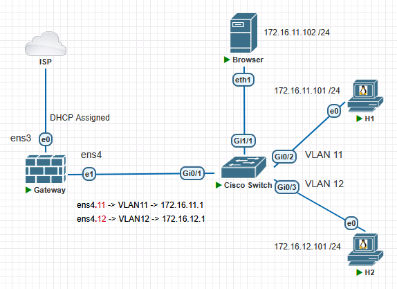

# Netfilter (Firewall, NAT) using iptables

#### Жұмыстың орындалу қадамы: 
  1) [interVLAN Routing конфигурациялау](https://github.com/Kaiyrkhan/Linux_Administration_101/blob/main/VLAN_interVLANRouting.md);
  2) Firewall, NAT using iptables;
  3) Нәтижені тексеру.

#### 🖧 Network Topology


> `Web (HTTP, HTTPS)` - TCP 80,443  
> `SSH` - TCP 22  
> `NTP` - UDP 123  
> `DHCP` - UDP 67,68  
> `DNS` - UDP 53  
> `SAMBA` - TCP 445,139 / UDP 137,138  
> `FTP` - TCP 21 + PASV port TCP "10090-10100"  

## Firewall, NAT using iptables

##### iptables пакетін орнату және конфигурациялау
```shell
$ sudo apt update
$ sudo apt install iptables

Verify the Installation
$ sudo iptables -V
$ sudo iptables --version

Check Current Rules
$ sudo iptables -L
```

```shell
$ sudo iptables -A INPUT -i lo -j ACCEPT
$ sudo iptables -A INPUT -p tcp --dport 22 -j ACCEPT
$ sudo iptables -A INPUT -p tcp --dport 80 -j ACCEPT

$ sudo iptables -vnL
немесе
$ sudo iptables -t filter -vnL
```

```shell
Inserting Rules
$ sudo iptables -I INPUT 1 -p tcp --dport 443 -j ACCEPT

Listing Rules
$ sudo iptables -vnL --line-numbers

Deleting Rules
$ sudo iptables -D INPUT 1
```

```shell
sudo iptables -P INPUT DROP
sudo iptables -P FORWARD DROP

sudo iptables -P INPUT ACCEPT
sudo iptables -P FORWARD ACCEPT
```

```shell
Clear input chain
$ sudo iptables -F INPUT

Flush the whole iptables
$ sudo iptables -F
```

```shell
Өзгерісті сақтау және қайта жүктеу (Saving and Reloading IPTables Rules)

$ sudo apt install iptables-persistent
$ sudo systemctl status netfilter-persistent

$ sudo netfilter-persistent save
$ sudo netfilter-persistent reload

$ sudo iptables-save > /etc/iptables/rules.v4
$ sudo iptables-restore < /etc/iptables/rules.v4

/etc/network/if-pre-up.d/iptables
```

##### Network Address Translation (NAT)
```shell
$ sudo iptables -t nat -vnL

$ sudo iptables -t nat -A POSTROUTING -s 172.16.11.0/24 -o ens3 -j MASQUERADE
$ sudo iptables -t nat -A POSTROUTING -s 172.16.12.0/24 -o ens3 -j MASQUERADE
```

```shell
$ sudo netfilter-persistent save
$ sudo netfilter-persistent reload
```

```shell
Нəтижені тексеру
VPC1> ping 8.8.8.8
VPC2> ping 8.8.8.8
```

### Troubleshooting
```shell
$ sudo iptables -F

sudo iptables -P INPUT DROP
sudo iptables -P FORWARD DROP

$ sudo netfilter-persistent save
$ sudo netfilter-persistent reload
```
###### 1-мысал: INPUT бойынша ICMP хаттамаға рұқсат ету
```shell
VPC1> ping 172.16.11.1
$ sudo iptables -A INPUT -p icmp -j ACCEPT
VPC1> ping 172.16.11.1
```

###### 2-мысал: FORWARD бойынша ICMP хаттамаға рұқсат ету
```shell
VPC1> ping 172.16.12.101
VPC1> ping 8.8.8.8
$ sudo iptables -A FORWARD -p icmp -j ACCEPT
VPC1> ping 172.16.12.101
VPC1> ping 8.8.8.8
```

###### 3-мысал: Conntrack және DNS портына рұқсат ету
```shell
VPC1> ping google.com

$ sudo iptables -A FORWARD -p udp --dport 53 -s 172.16.11.0/24 -j ACCEPT

$ sudo iptables -A INPUT -m conntrack --ctstate ESTABLISHED,RELATED -j ACCEPT

VPC1> ping google.com
```

###### 4-мысал: HTTP, HTTPS хаттамаларына рұқсат ету
```shell
$ sudo iptables -A FORWARD -p tcp -m multiport --ports 80,443 -s 172.16.11.0/24 -j ACCEPT

nc -w1 -vz 172.16.11.1 80
```

###### 5-мысал: Port Forwarding
```shell
Change external port 8080 to internal port 80:
$ sudo iptables -t nat -A PREROUTING -p tcp --dport 8080 -j REDIRECT --to-port 80
```

###### Қосымша ақпарат

```shell
Translating from iptables to nftables

$ sudo iptables-translate -A INPUT -p tcp --dport 22 -m conntrack --ctstate NEW -j ACCEPT
  nft add rule ip filter input tcp dport 22 ct state new counter accept
$ sudo ip6tables-translate -A FORWARD -i eth0 -o eth2 -p udp -m multiport --dport 111,222 -j ACCEPT
немесе
$ sudo iptables-save > save.txt
$ sudo iptables-restore-translate -f save.txt > ruleset.nft
```

### References

1) [Wikipedia Netfilter](https://en.wikipedia.org/wiki/Netfilter)
