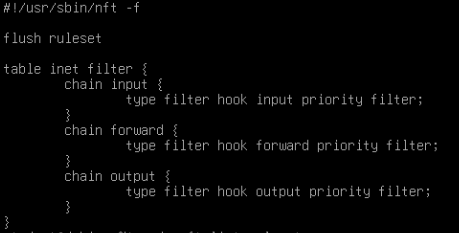
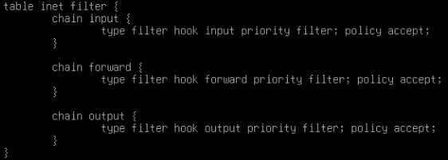

# Netfilter (Firewall, NAT) using nftables

#### Жұмыстың орындалу қадамы: 
  1) [interVLAN Routing конфигурациялау](https://github.com/Kaiyrkhan/Linux_Administration_101/blob/main/VLAN_interVLANRouting.md);
  2) Firewall, NAT using nftables;
  3) Нәтижені тексеру.

#### 🖧 Network Topology


> `Web (HTTP, HTTPS)` - TCP 80,443  
> `SSH` - TCP 22  
> `NTP` - UDP 123  
> `DHCP` - UDP 67,68  
> `DNS` - UDP 53  
> `SAMBA` - TCP 445,139 / UDP 137,138  
> `FTP` - TCP 21 + PASV port TCP "10090-10100"  

## Құрылғының атауын (Device Name) өзгерту

```shell
$ sudo hostnamectl set-hostname GW
$ sudo nano /etc/hosts
127.0.1.1  GW
Ctrl+O -> Enter -> Ctrl+X -> Ctrl+L
$ bash
```

```shell
$ sudo nano /etc/hosts
127.0.1.1  H1
Ctrl+O -> Enter -> Ctrl+X -> Ctrl+L

$ sudo hostnamectl set-hostname H1
$ bash
```

## Firewall, NAT using nftables

Пакеттің (Package) жүйеге орнатылғанын тексеру
```shell
$ dpkg -l nftables
$ dpkg -s nftables
```

Check Current Rules
```shell
$ sudo nft list ruleset
```
```shell
$ cat /etc/nftables.conf
```


Daemon/Service-ті жүктеу және автожүктеу қызметіне қосу
```shell
$ sudo systemctl status nftables

$ sudo systemctl start nftables          // nftables daemon-ын жүктеу
$ sudo systemctl enable nftables         // nftables daemon-ын автожүктеу қызметіне қосу
```

Check Current Rules
```shell
$ sudo nft list ruleset
```

```shell
$ cat /etc/nftables.conf
```


```shell
Set Default Policy to DROP (INPUT and FORWARD Chains)

$ sudo nft chain inet filter input { policy drop \; }
$ sudo nft сhain inet filter forward { policy drop \; }
```
немесе
```shell
Create a New Table and Chains

$ sudo nft add table inet filter  
$ sudo nft add chain inet filter INPUT { type filter hook input priority 0 \; policy drop \; }  
$ sudo nft add chain inet filter FORWARD { type filter hook forward priority 0 \; policy drop \; }  
$ sudo nft add chain inet filter OUTPUT { type filter hook output priority 0 \; policy accept \; }
```

Check Current Rules
```shell
$ sudo nft list ruleset
$ cat /etc/nftables.conf
```

Save nftables Configuration
```shell
$ sudo nft list ruleset | sudo tee /etc/nftables.conf
$ sudo systemctl restart nftables
```

Check Current Rules
```shell
$ sudo nft list ruleset                // жедел жадыда (RAM) сақталған kernel-дегі ережелер (running-config)
$ cat /etc/nftables.conf               // дискде (HDD/SSD) сақталған конфигурация (saved-config)
```

Add a New Rule to the INPUT Chain
```shell
Allow/Open Port 22 (SSH)
$ sudo nft add rule inet filter input ip saddr 172.16.11.101/32 tcp dport 22 counter accept

Check Current Rules
$ sudo nft list ruleset
$ cat /etc/nftables.conf

Save nftables Configuration
$ sudo nft list ruleset | sudo tee /etc/nftables.conf
$ sudo systemctl restart nftables                            // nftables daemon-ын қайтажүктеу

Check Current Rules
$ sudo nft list ruleset
$ cat /etc/nftables.conf
```

**Қосымша ақпарат**

```shell
$ sudo nano /etc/nftables.conf
$ sudo systemctl restart nftables

$ sudo nft list ruleset
$ cat /etc/nftables.conf
```

```shell
$ sudo nano ~/rules.nftables
$ sudo nft -f ~/rules.nftables

$ sudo nft list ruleset
$ cat ~/rules.nftables
```

nftables-тегі family түрлері

| Family атауы | Хаттамалар  |
| ------------ | ----------- |
| ip           | IPv4        |
| ip6          | IPv6        |
| inet         | IPv4 + IPv6 |


##### 1-мысал: Loopback интерфейске рұқсат ету
```shell
student@gateway:~$ ping -c4 127.0.0.1

$ sudo nft add rule inet filter input iifname "lo" counter accept

student@gateway:~$ ping -c4 127.0.0.1
```

##### 2-мысал: ping H1,H2 to Gateway (ICMP хаттамаға рұқсат ету)
```shell
student@H1:~$ ping -c4 172.16.11.1
student@gateway:~$ ping -c4 172.16.11.101

$ sudo nft add rule inet filter input ip protocol icmp counter accept

student@H1:~$ ping -c4 172.16.11.1
student@gateway:~$ ping -c4 172.16.11.101
```

##### 3-мысал: ping H1 to H2 (ICMP хаттамаға рұқсат ету)
```shell
student@H1:~$ ping -c4 172.16.12.101
student@H2:~$ ping -c4 172.16.11.101

$ sudo nft add rule inet filter forward ip protocol icmp counter accept

student@H1:~$ ping -c4 172.16.12.101
student@H2:~$ ping -c4 172.16.11.101
```
*ICMP (IPv4) type:* ***echo-reply, echo-request, destination-unreachable, time-exceeded, parameter-problem т.б.***

> $ sudo nft add rule inet filter input icmp type echo-request accept  
> $ sudo nft add rule inet filter input icmp type { echo-request, echo-reply, destination-unreachable, time-exceeded } accept  

> $ sudo nft add rule inet filter forward iifname "ens3" ip saddr 172.16.11.0/24 ip daddr 172.16.12.0/24 counter accept  
> $ sudo nft add rule inet filter forward iifname "ens3" ip saddr 172.16.12.0/24 ip daddr 172.16.11.0/24 counter accept  

##### 4-мысал: LAN желідегі құрылғыларды internet желісімен байланыстыру
```shell
student@gateway:~$ ping 8.8.8.8
student@gateway:~$ ping google.com
```
```shell
student@H1:~$ ping 8.8.8.8
student@H1:~$ ping google.com
```

Priority мәндері:
| Symbolic Name | Equivalent Numeric Value |
|---------------|--------------------------|
| `raw`         | -300                     |
| `mangle`      | -150                     |
| `dstnat`      | -100                     |
| `filter`      | 0                        |
| `srcnat`      | 100                      |
| `security`    | 150                      |


```shell
Network Address Translation (NAT)

$ sudo nft add table inet nat
$ sudo nft add chain inet nat POSTROUTING { type nat hook postrouting priority srcnat \; policy accept \; }
$ sudo nft add rule inet nat POSTROUTING ip saddr 172.16.11.0/24 oifname "ens3" counter masquerade
$ sudo nft add rule inet nat POSTROUTING ip saddr 172.16.12.0/24 oifname "ens3" counter masquerade
```

```shell
Netfilter Connection Tracking (Conntrack)

$ sudo nft add rule inet filter input ct state established,related counter accept
$ sudo nft add rule inet filter input ct state invalid counter drop
```

*ct state-тің негізгі аргументтері:* ***new, established, related, invalid***  
> $ sudo nft add rule inet filter input tcp dport { 22, 80, 443 } ct state **new** accept  
> $ sudo nft add rule inet filter input ct state **established,related** accept  
> $ sudo nft add rule inet filter input ct state **invalid** drop  

> $ ... ct state snat log  
> $ ... ct state dnat log  
> $ ... ct status dnat  
> $ ... ct status snat  

```shell
student@gateway:~$ ping 8.8.8.8
student@gateway:~$ ping google.com
```
```shell
student@H1:~$ ping 8.8.8.8
student@H1:~$ ping google.com
```

```shell
student@H1:~$ ping google.com
student@H2:~$ ping google.com

$ sudo nft add rule inet filter forward ct state established,related counter accept
$ sudo nft add rule inet filter forward udp dport 53 ip saddr 172.16.11.0/24 counter accept
$ sudo nft add rule inet filter forward udp dport 53 ip saddr 172.16.12.0/24 counter accept

student@H1:~$ ping google.com
student@H2:~$ ping google.com
```

### Қосымша ақпарат

Add a New Rule (жаңа ереже қосу)
```shell
$ sudo nft add rule inet filter input tcp dport 22 ct state new accept
```
> *add – жаңа қосқан ережені position бойынша СОҢЫНА қоюды*  
> position – ережелердің орналасу/орындалу реті

insert a New Rule (жаңа ереже енгізу)
```shell
$ sudo nft insert rule inet filter input tcp dport 22 ct state new accept
```
> *insert – жаңа қосқан ережені position бойынша БАСЫНА қоюды*  
> position – ережелердің орналасу/орындалу реті

handle және index нөмір қолдану арқылы ережелердің орналасу ретін (position) алмастыру
```shell
$ sudo nft -a list ruleset        // Ережелердің handle нөмірін көру

$ sudo nft insert rule inet filter input handle 2  tcp dport 22 counter accept      // енгізген ережені, handle 2 нөмірдегі ереженің алдына қою арқылы орын алмасады

$ sudo nft insert rule inet filter input index 2 tcp dport 22 ct state new accept      // орналасу реті бойынша үшінші орынға қоюды, себебі index мәні "0"-ден басталады
$ sudo nft insert rule inet filter input index 0 tcp dport 22 ct state new accept      // ережелердің ең басына қоюды
```

Delete a Rule (ережені жою)
```shell
$ sudo nft -a list ruleset        // Ережелердің handle нөмірін көру

$ sudo nft delete rule inet filter input handle 13
```

Replace a Rule (ережені ауыстыру)
```shell
$ sudo nft -a list ruleset

$ sudo nft replace rule inet filter input handle 14   tcp dport 22 ct state new accept      // енгізген ережені, handle 14 нөмірдегі ережемен ауыстырады
```

Clear all Rules (ережелерді тазалау)
```shell
$ sudo nft flush ruleset
```

Diagnostic Commands
```shell
$ sudo nft list ruleset

$ sudo nft list tables
$ sudo nft list tables inet
$ sudo nft list table inet filter

$ sudo nft list chains
$ sudo nft list chains inet
$ sudo nft list chain inet filter input
```

> `NTP` - UDP 123  
> `DHCP` - UDP 67,68  
> `DNS` - UDP 53  
> `SAMBA` - TCP 445,139 / UDP 137,138  
> `Web (HTTP, HTTPS)` - TCP 80,443  
> `FTP` - TCP 21 + PASV port TCP "10090-10100"  

Allow/Open Ports for LAN
```shell
$ sudo nft add rule inet filter input iifname "lo" counter accept

$ sudo nft add rule inet filter input tcp dport 22 ip saddr 172.16.11.101/32 counter accept
$ sudo nft add rule inet filter input tcp dport 22 ether saddr 5C:60:BA:58:9F:2B counter accept

$ sudo nft add rule inet filter input tcp dport { 80,443,445 } ip saddr 172.16.11.0/24  counter accept
$ sudo nft add rule inet filter input udp dport { 53,67,68,123,138 } ip saddr 172.16.11.0/24 counter accept
```

```shell
Scanning TCP Ports
$ nc -w1 -vz 172.16.11.1 22
$ nc -w1 -vz 172.16.11.1 80 443

Scanning UDP Ports
$ nc -w1 -u -vz 172.16.11.1 123
$ nc -w1 -u -vz 172.16.11.1 53
```

```shell
$ sudo nft add rule inet filter input ip protocol icmp counter log prefix \"ICMP_TRACE\ "
$ sudo nft add rule inet filter input ip protocol icmp counter accept
$ sudo tail -f /var/log/messages

$ sudo nft add rule inet filter input icmp type echo-request meta length 93-65535 counter drop
$ sudo nft add rule inet filter input ip protocol icmp counter accept
$ ping 172.16.11.1 -L 32      // Windows default 32 byte
$ ping 172.16.11.1 -L 64      // Linux default 64 byte
$ ping 172.16.11.1 -L 65

$ sudo nft add rule inet filter input icmp type echo-request meta length 93-65535 counter drop
$ sudo nft add rule inet filter input ip protocol icmp limit rate 50/second burst 25 packets counter accept
$ ping 172.16.11.1 -t
```

Allow/Open Ports for LAN and WAN
```shell
$ sudo nft add rule inet filter input tcp dport 21 counter accept
$ sudo nft add rule inet filter input tcp dport 10090-10100 counter accept
```

### References

1) [Wikipedia Netfilter](https://en.wikipedia.org/wiki/Netfilter)
