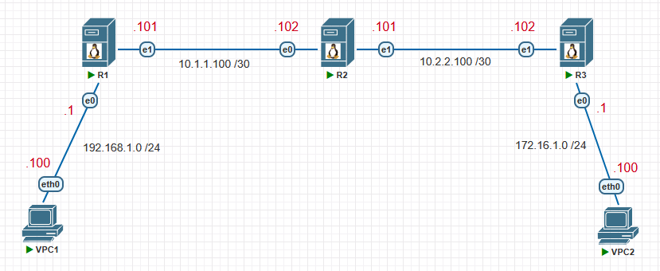

# Static route on Linux

### Топология


### Virtual PC Simulator
```shell
VPCS> ip 192.168.1.100/24 192.168.1.1
VPCS> show ip
VPCS> save
```
```shell
VPCS> ip 172.16.1.100/24 172.16.1.1
VPCS> show ip
VPCS> save
```

### Static route on Debian

**R1**
```shell
$ sudo nano /etc/network/interfaces
  auto ens3
  iface ens3 inet static
  address 192.168.1.1
  netmask 255.255.255.0

  auto ens4
  iface ens4 inet static
  address 10.1.1.101
  netmask 255.255.255.252
  up ip route add 172.16.1.0/24 via 10.1.1.102
```

**R2**
```shell
$ sudo nano /etc/network/interfaces
  auto ens3
  iface ens3 inet static
  address 10.1.1.102
  netmask 255.255.255.252
  up ip route add 192.168.1.0/24 via 10.1.1.101

  auto ens4
  iface ens4 inet static
  address 10.2.2.102
  netmask 255.255.255.252
  up ip route add 172.16.1.0/24 via 10.2.2.101
```

**R3**
```shell
$ sudo nano /etc/network/interfaces
  auto ens3
  iface ens3 inet static
  address 172.16.1.1
  netmask 255.255.255.0

  auto ens4
  iface ens4 inet static
  address 10.2.2.101
  netmask 255.255.255.252
  up ip route add 192.168.1.0/24 via 10.2.2.102
```

### Static route on Ubuntu

**R1**
```shell
$ sudo nano /etc/netplan/*.yaml
network:
  ethernets:
    ens3:
      dhcp4: false
      addresses: [192.168.1.1/24]
    ens4:
      dhcp4: false
      addresses: [10.1.1.101/30]
      routers:
        - to: 172.16.1.0/24
          via: 10.1.1.102
version: 2
```

**R2**
```shell
$ sudo nano /etc/netplan/*.yaml
network:
  ethernets:
    ens3:
      dhcp4: false
      addresses: [10.1.1.102/30]
      routers:
        - to: 192.168.1.0/24
          via: 10.1.1.101
    ens4:
      dhcp4: false
      addresses: [10.2.2.102/30]
      routers:
        - to: 172.16.1.0/24
          via: 10.2.2.101
version: 2
```

**R3**
```shell
$ sudo nano /etc/netplan/*.yaml
network:
  ethernets:
    ens3:
      dhcp4: false
      addresses: [172.16.1.1/24]
    ens4:
      dhcp4: false
      addresses: [10.2.2.101/30]
      routers:
        - to: 192.168.1.0/24
          via: 10.2.2.102
version: 2
```

### Static route on Oracle 7.9

**R2**
```shell
$ ip address
eth0
eth1
$ ls /etc/sysconfig/network-scripts/
ifcfg-eth0
$ sudo nmcli conn add type ethernet

```


