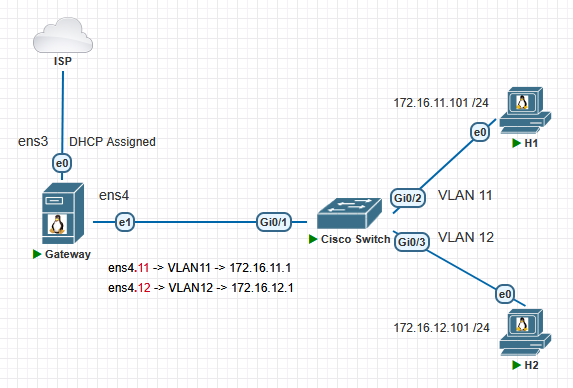

# VLAN and interVLAN Routing on Debian 12.x 

#### Жұмыстың орындалу қадамы: 
  1) 802.1Q VLAN құру;
  2) IP Packet Forwarding қызметін қосу;
  3) Cisco Switch конфигурациялау;
  4) End Device (H1, H2) құрылғыны конфигурациялау;
  5) Нәтижені тексеру.

#### Physical Network Topology


#### Logical Network Topology
  
[Download Link for PNETLab Topology File](Topology/Topology_interVLANRouting_NAT_Linux.unl)

### 1-қадам: 802.1Q VLAN құру

**8021q модулін жүктеу және автожүктеу қызметіне қосу**
```shell
8021q модулін жүктеу
$ sudo modprobe 8021q

8021q модулінің жүктелгенін тексеру
$ lsmod | grep 8021q

8021q модулін автожүктеу (startup) қызметіне қосу
$ echo "8021q" | sudo tee /etc/modules-load.d/8021q.conf
```

**Virtual interface (VLAN11 және VLAN12) құру**
```shell
$ ip address
```

```shell
$ sudo nano /etc/network/interfaces
  auto ens3
  iface ens3 inet dhcp

  # Physical interface ens4
  auto ens4
  iface ens4 inet manual

  # Virtual interface VLAN11
  auto ens4.11
  iface ens4.11 inet static
    address 172.16.11.1/24
    vlan-raw-device ens4

  # Virtual interface VLAN12
  auto ens4.12
  iface ens4.12 inet static
    address 172.16.12.1/24
    vlan-raw-device ens4
```

```shell
$ sudo systemctl restart networking

немесе

$ sudo ifdown ens4 && sudo ifup ens4
$ sudo ifup ens4.11
$ sudo ifup ens4.12
```

VLAN құрылғанын тексеру
```shell
$ sudo cat /proc/net/vlan/config
```
```shell
$ ip -d link show ens4.11
$ ip -d link show ens4.12
```

### 2-қадам: IP Packet Forwarding қызметін іске қосу (enable)
```shell
$ cat /proc/sys/net/ipv4/ip_forward
0
```

```shell
$ sudo nano /etc/sysctl.conf
net.ipv4.ip_forward=1
$ sudo sysctl -p
```

```shell
$ cat /proc/sys/net/ipv4/ip_forward
1
```

### 3-қадам: Cisco Switch конфигурациялау

**Trunk Port тағайындау**
```shell
configure terminal

interface g0/1
switchport trunk encapsulation dot1q
switchport mode trunk
switchport trunk allowed vlan 11,12
switchport nonegotiate

show int trunk
show int status
show int g0/1 switchport
```

**Access Port тағайындау**
```shell
configure terminal
vlan 11
vlan 12

interface g0/2
switchport mode access
switchport access vlan 11

interface g0/3
switchport mode access
switchport access vlan 12

show vlan brief
```

**Save Configuration**
```shell
copy run start
```

### 4-қадам: End Device (H1, H2) құрылғыны конфигурациялау

**Құрылғының атауын (Device Name) өзгерту**
```shell
$ sudo nano /etc/hosts
127.0.1.1  H1
Ctrl+O -> Enter -> Ctrl+X -> Ctrl+L

$ sudo hostnamectl set-hostname H1
$ bash
```

**Желілік интерфейсті конфигурациялау**
```shell
$ sudo nano /etc/network/interfaces
  auto ens3
  iface ens3 inet static
  address 172.16.11.101/24
  gateway 172.16.11.1
  dns-nameservers 8.8.8.8
  dns-search edu.local
```
```shell
$ sudo nano /etc/resolv.conf
  dns-nameservers 8.8.8.8
  dns-search edu.local
```
```shell
$ sudo systemctl restart networking
```
```shell
$ ip address
$ ip route
$ cat /etc/resolv.conf
```

### 5-қадам: Нəтижені тексеру
```shell
ping H1 to H2

student@H1:~$ ping -c4 172.16.11.1
student@H1:~$ ping -c4 172.16.12.101
```
