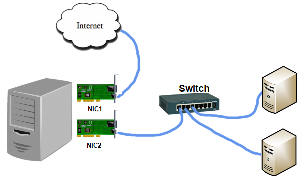

# interVLAN Routing on Linux 

#### Тақырыбы: Linux дистрибутивінде 802.1Q VLAN конфигурациялау

#### Жұмыстың орындалу қадамы: 
  1) 802.1Q VLAN құру;
  2) IP Packet Forwarding қызметін қосу;
  3) Cisco Switch конфигурациялау;
  4) Virtual PC Simulator-ды конфигурациялау;
  5) NAT конфигурациялау (using nftables);
  6) NAT конфигурациялау (using iptables);
  7) NAT конфигурациялау (using Firewalld).

#### Physical Topology

#### Logical Topology


### 1) 802.1Q VLAN құру

##### 8021q модулін жүктеу және автожүктеу қызметіне қосу
```shell
8021q модулін жүктеу
$ sudo modprobe 8021q

8021q модулінің жүктелгенін тексеру
$ lsmod | grep 8021q

8021q модулін автожүктеу (startup) қызметіне қосу
$ echo "8021q" | sudo tee -a /etc/modules-load.d/8021q.conf
```

##### Virtual interface (VLAN11 және VLAN12) құру
```shell
$ ip address
```

```shell
$ sudo nano /etc/network/interfaces
  auto ens3
  iface ens3 inet dhcp

  # Virtual interface VLAN11
  auto ens4.11
  iface ens4.11 inet static
  address 172.16.11.1/24
  vlan-raw-device ens4

  # Virtual interface VLAN12
  auto ens4.12
  iface ens4.12 inet static
  address 172.16.12.1/24
  vlan-raw-device ens4
```

```shell
$ sudo systemctl restart networking

$ sudo ifdown ens4 && sudo ifup ens4
$ sudo ifup ens4.11
$ sudo ifup ens4.12
```

```shell
$ ip -d link show ens4.11
$ ip -d link show ens4.12
```

```shell
VLAN құрылғанын тексеру
$ sudo cat /proc/net/vlan/config
```

### 2) IP Packet Forwarding қызметін қосу (enable)
```shell
$ cat /proc/sys/net/ipv4/ip_forward
0
```

```shell
$ sudo nano /etc/sysctl.conf
net.ipv4.ip_forward=1
$ sudo sysctl -p
```

```shell
$ cat /proc/sys/net/ipv4/ip_forward
1
```

### 3) Cisco Switch конфигурациялау

##### Trunk Port
```shell
configure terminal

interface g0/1
switchport trunk encapsulation dot1q
switchport mode trunk
switchport trunk allowed vlan 11,12
switchport nonegotiate

show int trunk
show int status
show int g0/1 switchport
```

##### Access Port
```shell
configure terminal
vlan 11
vlan 12
show vlan brief

interface g0/2
switchport mode access
switchport access vlan 11

interface g0/3
switchport mode access
switchport access vlan 12

show vlan brief
```

##### Save Configuration
```shell
copy run startup
```

### 4) Virtual PC Simulator-ды конфигурациялау
```shell
VPC1> ip 172.16.11.101/24 172.16.11.1
VPCS> ip dns 8.8.8.8
VPC1> show ip
VPC1> save
```
```shell
VPC2> ip 172.16.12.101/24 172.16.12.1
VPCS> ip dns 8.8.8.8
VPC2> show ip
VPC2> save
```

##### Нəтижені тексеру
```shel
ping VPC1 to VPC2

VPC1> ping 172.16.11.1
VPC1> ping 172.16.12.101
```

### 6) NAT конфигурациялау (using iptables)

##### iptables пакетін орнату және конфигурациялау
```shel
$ sudo apt update
$ sudo apt install iptables

$ sudo iptables -V
$ sudo iptables -L
```

```shel
$ sudo iptables -A INPUT -p tcp --dport 22 -j ACCEPT
$ sudo iptables -A INPUT -p tcp --dport 80 -j ACCEPT
$ sudo iptables -A INPUT -m conntrack --ctstate ESTABLISHED,RELATED -j ACCEPT

$ sudo iptables -vnL
немесе
$ sudo iptables -t filter -vnL
```

```shel
$ sudo iptables -I INPUT 1 -p tcp --dport 443 -j ACCEPT

$ sudo iptables -vnL --line-numbers
$ sudo iptables -D INPUT 1
```

```shel
Өзгерістерті сақтау (Saving Rules)
$ sudo apt install iptables-persistent
$ sudo netfilter-persistent save
$ sudo netfilter-persistent reload
```

```shel
sudo iptables -P INPUT DROP
sudo iptables -P FORWARD DROP
```

```shel
Clear input chain
$ sudo iptables -F INPUT

Flush the whole iptables
$ sudo iptables -F
```

##### Тәжірибе
```shel
$ sudo iptables -F

sudo iptables -P INPUT DROP
sudo iptables -P FORWARD DROP

$ sudo netfilter-persistent save
$ sudo netfilter-persistent reload
```
###### 2-тәжірибе: INPUT бойынша ICMP хаттамаға рұқсат ету
```shel
VPC1> ping 172.16.11.1
$ sudo iptables -A INPUT -p icmp -j ACCEPT
VPC1> ping 172.16.11.1
```

###### 2-тәжірибе: FORWARD бойынша ICMP хаттамаға рұқсат ету
```shel
VPC1> ping 172.16.12.101
VPC1> ping 8.8.8.8
$ sudo iptables -A FORWARD -p icmp -j ACCEPT
VPC1> ping 172.16.12.101
VPC1> ping 8.8.8.8
```

###### 3-тәжірибе: Conntrack және DNS портына рұқсат ету
```shel
VPC1> ping google.com
$ sudo iptables -A FORWARD -p udp --dport 53 -s 172.16.11.0/24 -j ACCEPT
$ sudo iptables -A INPUT -m conntrack --ctstate ESTABLISHED,RELATED -j ACCEPT
VPC1> ping google.com
```

###### 4-тәжірибе: HTTP, HTTPS хаттамаларына рұқсат ету
```shel
$ sudo iptables -A FORWARD -p tcp -m multiport --ports 80,443 -s 172.16.11.0/24 -j ACCEPT
```

##### Network Address Translation (NAT)
```shel
$ sudo iptables -t nat -A POSTROUTING -s 172.16.11.0/24 -o ens3 -j MASQUERADE
$ sudo iptables -t nat -A POSTROUTING -s 172.16.12.0/24 -o ens3 -j MASQUERADE

$ sudo iptables -t nat -vnL
```

```shel
$ sudo netfilter-persistent save
$ sudo netfilter-persistent reload

$ sudo iptables -t nat -vnL
```

##### Нəтижені тексеру
```shel
VPC1> ping 8.8.8.8
VPC2> ping 8.8.8.8
```
