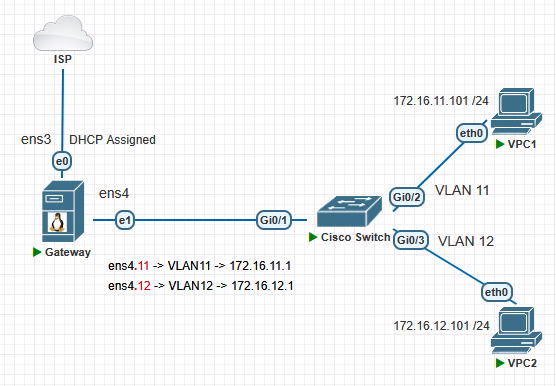

# interVLAN Routing on Linux 

### Тақырыбы: Linux дистрибутивінде 802.1Q VLAN конфигурациялау

### Жұмыстың орындалу қадамы: 
  1) 802.1Q VLAN құру;
  2) IP Packet Forwarding қызметін қосу;
  3) Cisco Switch конфигурациялау;
  4) Нəтижені тексеру.

### Physical Topology

### Logical Topology


## 802.1Q VLAN құру (Gateway)

### 8021q модулін жүктеу және автожүктеу қызметіне қосу
```shell
8021q модулін жүктеу
$ sudo modprobe 8021q

8021q модулінің жүктелгенін тексеру
$ lsmod | grep 8021q

8021q модулін автожүктеу (startup) қызметіне қосу
$ echo "8021q" | sudo tee -a /etc/modules-load.d/8021q.conf
```

### Virtual interface (VLAN11 және VLAN12) құру
```shell
$ ip address
```

```shell
$ sudo nano /etc/network/interfaces
  auto ens3
  iface ens3 inet dhcp

  # Virtual interface VLAN11
  auto ens4.11
  iface ens4.11 inet static
  address 172.16.11.1/24
  vlan-raw-device ens4

  # Virtual interface VLAN12
  auto ens4.12
  iface ens4.12 inet static
  address 172.16.12.1/24
  vlan-raw-device ens4
```

```shell
$ sudo systemctl restart networking

$ sudo ifdown ens4 && sudo ifup ens4
$ sudo ifup ens4.11
$ sudo ifup ens4.12
```

```shell
$ ip -d link show ens4.11
$ ip -d link show ens4.12
```

```shell
VLAN құрылғанын тексеру
$ sudo cat /proc/net/vlan/config
```

### IP Packet Forwarding қызметін қосу (enable)
```shell
cat /proc/sys/net/ipv4/ip_forward
0
```

```shell
$ sudo nano /etc/sysctl.conf
net.ipv4.ip_forward=1
$ sudo sysctl -p
```

```shell
cat /proc/sys/net/ipv4/ip_forward
1
```

## Cisco Switch конфигурациялау

### Trunk interface құру
```shell
enable
configure terminal
interface g0/1
switchport trunk encapsulation dot1q
switchport mode trunk
switchport trunk allowed vlan 11,12
switchport nonegotiate

```
